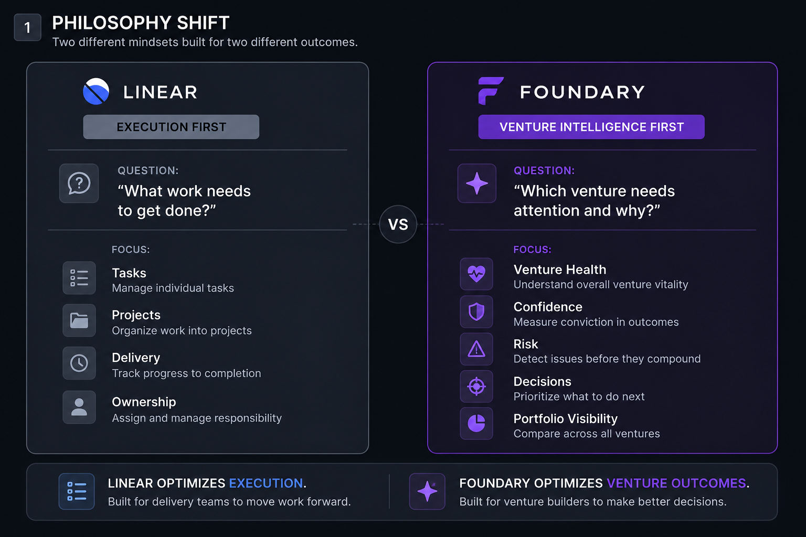
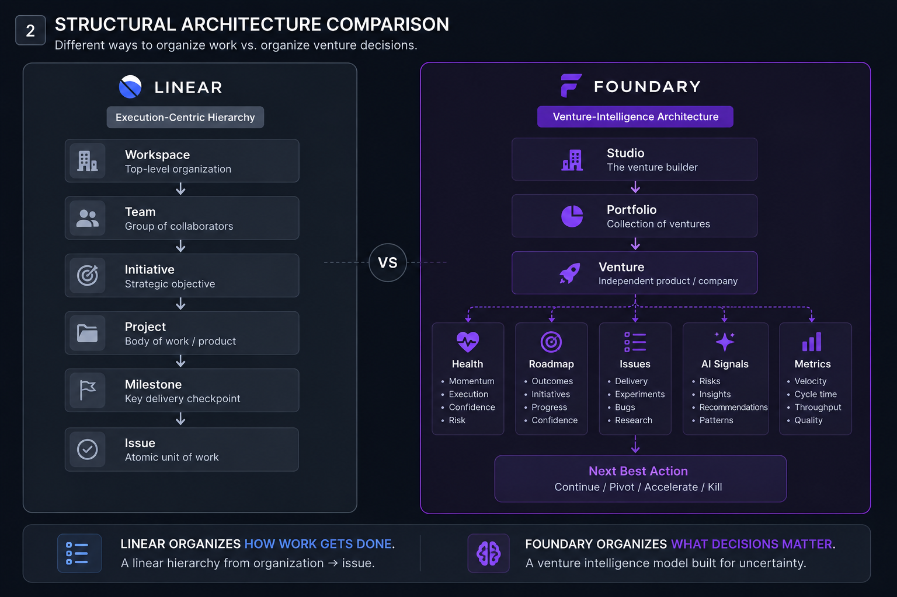
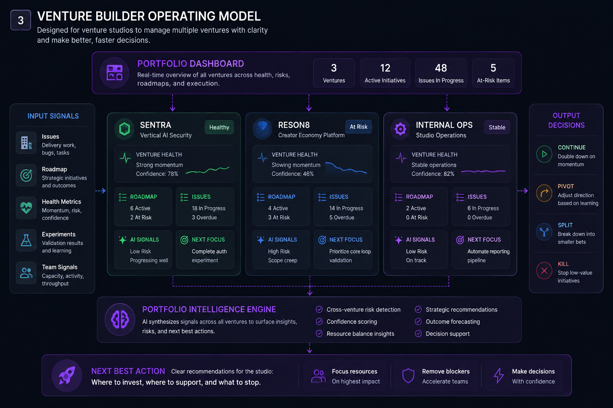
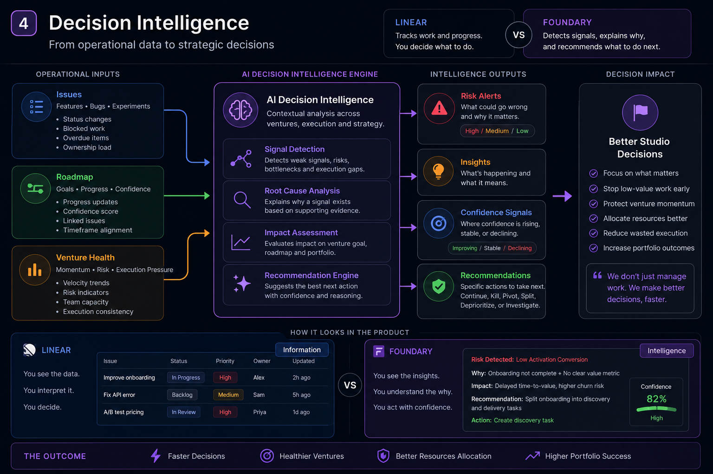

# Foundary vs Linear

Foundary is not Linear with a venture dropdown. Linear is an execution system
that can be adapted for venture studio work. Foundary is a venture-native
operating system designed around portfolio visibility, venture health, and fast
studio decisions.

For a company like One Studio, the core challenge is not only tracking tasks. It
is deciding which venture needs attention, where confidence is weak, what risk is
emerging, and whether the studio should continue, pivot, split scope, or stop.

## 1. Philosophy Shift



Linear starts with the question:

> What work needs to get done?

Foundary starts with the question:

> Which venture needs attention, and why?

Linear optimizes execution: tasks, projects, delivery, ownership, and progress.

Foundary optimizes venture outcomes: health, confidence, risk, portfolio
visibility, and strategic decisions.

## 2. Structural Architecture



Linear organizes work through a general execution hierarchy:

```txt
Workspace
  Team
    Initiative
      Project
        Milestone
          Issue
```

In the Linear demo setup, each venture is represented as a project, milestones
represent Shape / Ship / Scale stages, and labels such as `Decision Needed`,
`At Risk`, and `Customer Evidence` create venture context.

Foundary organizes around the venture itself:

```txt
Studio
  Portfolio
    Venture
      Health
      Roadmap
      Issues
      AI Signals
      Next Best Action
```

The key difference:

```txt
Linear organizes how work gets done.
Foundary organizes what decisions matter.
```

## 3. Venture Builder Operating Model



A venture builder manages multiple companies at once. Each venture may be at a
different stage, with different risks, evidence quality, execution pressure, and
strategic decisions.

Foundary is designed for that operating model:

- portfolio dashboard for all ventures
- venture health for momentum and risk
- roadmap confidence for strategic conviction
- issue visibility for execution pressure
- AI signals for operational intelligence
- next-best-action guidance for studio decisions

This makes Foundary useful beyond ticket tracking. It gives a studio a way to
see where to invest attention, where to support teams, and where to stop
low-value work early.

## 4. Decision Intelligence



In Linear, decision support is mostly manual:

```txt
Issue updated
  Label added
  Saved view surfaces work
  Manager interprets context
  Decision is made
```

In Foundary, the product is designed to turn operational data into decision
signals:

```txt
Issues + roadmap + venture health
  Operational intelligence
  Risk and confidence analysis
  Recommendation
  Continue / pivot / split / kill
```

Linear surfaces what teams report.

Foundary surfaces what leadership needs to decide.

## Best Fit

| Need | Linear | Foundary |
|---|---|---|
| Track tasks and ownership | Strong | Good |
| Manage delivery progress | Strong | Good |
| Coordinate engineering work | Strong | Secondary |
| Compare venture health | Manual setup | Native focus |
| Identify weak evidence | Manual labels | Product-level signal |
| Support continue / pivot / kill decisions | Manual review issues | Native operating model |
| Show portfolio visibility | Initiative + views | Core dashboard |
| Explain why a venture needs attention | Manual interpretation | Core product promise |

## Recommended Positioning

The strongest comparison is not that Foundary replaces Linear.

It is that Foundary operates at a different layer:

```txt
Linear = execution layer
Foundary = venture intelligence layer
```

Linear helps teams move work forward.

Foundary helps venture builders decide which work should matter.

For One Studio-style teams, that distinction is the product insight: venture
studios do not only need better project management. They need a calm operating
system for making better venture decisions, faster.
